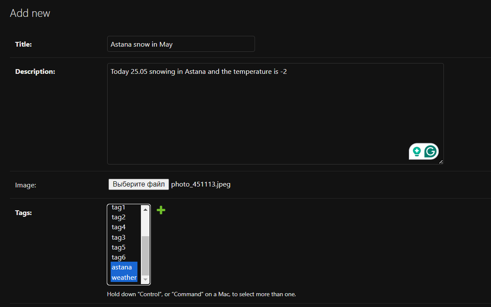
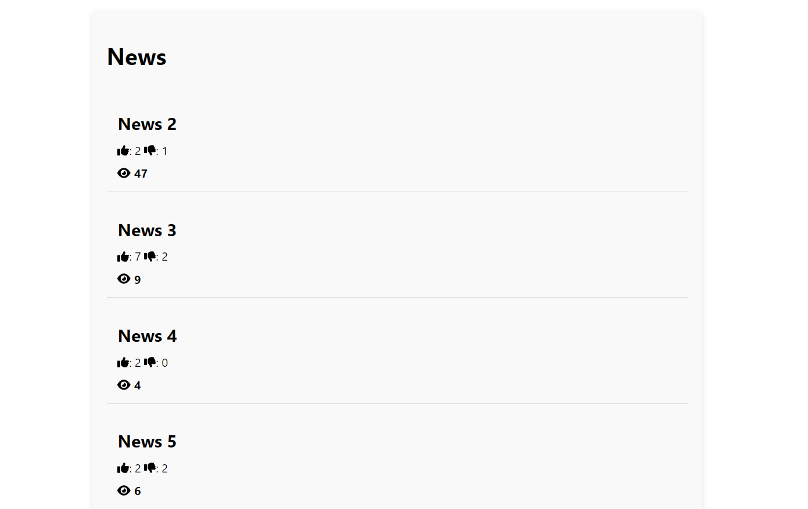
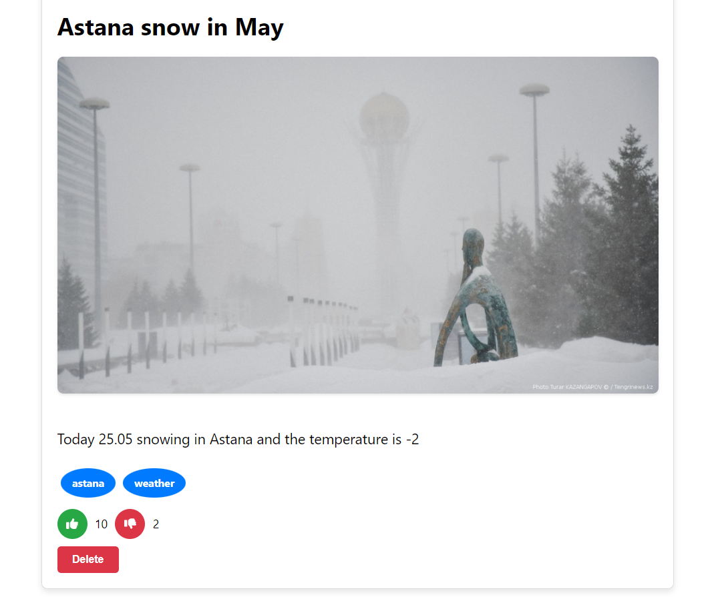
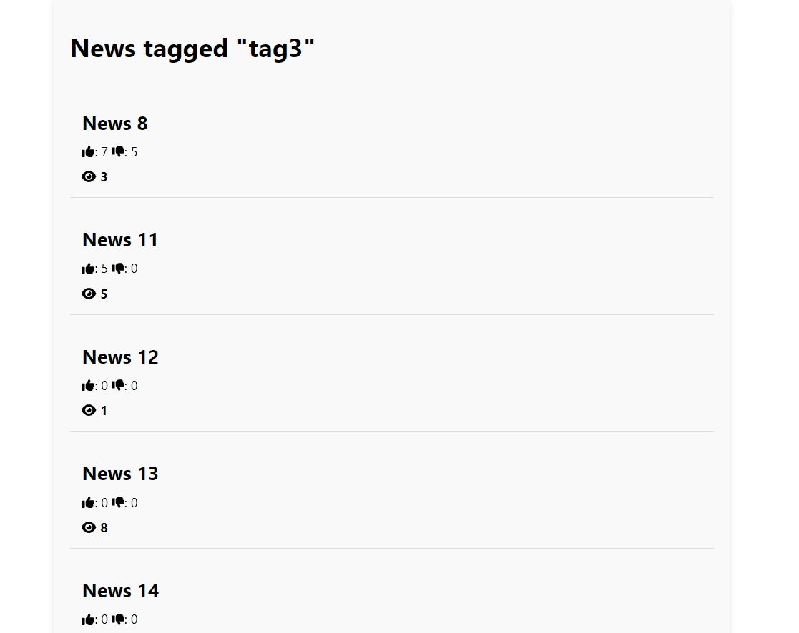

# News Application

This is a full-stack news application built with Django for the backend and React for the frontend. The application allows users to view, like, dislike, and navigate news articles by tags. It also features infinite scrolling and pagination to enhance user experience.

## Overview

The News Application is designed to allow users to read news articles, express their opinions through likes and dislikes, and filter articles based on tags. The backend is implemented using Django, providing a robust and scalable REST API. The frontend, built with React, delivers a dynamic and responsive user interface.

## Features

- **Add News Articles**: Admins can add a list of news articles.


- **View News Articles**: Users can browse through a list of news articles.


- **Infinite Scrolling**: Automatically loads more articles as the user scrolls down.
- **Likes and Dislikes**: Users can view every article and like or dislike news articles (delete can be done for specific users).


- **View Articles by Tags**: Users can click on tags to filter and view articles associated with a specific tag.


- **Pagination**: The backend supports paginated responses to efficiently handle large datasets.

## API Endpoints

### List of Endpoints

- `/api/news/`: List and create news articles.
- `/api/news/<id>/`: Retrieve, update, or delete a news article.
- `/api/news/<id>/like/`: Like a news article.
- `/api/news/<id>/dislike/`: Dislike a news article.
- `/api/news/tag/<tag_name>/`: List news articles by tag.
- `/api/news/<id>/increment-views/`: Update view for the article),


### Example API Response

```json
[
    {
        "id": 28,
        "title": "Shocking News in Astana",
        "description": "Astana is in the second place among the most cold capitals",
        "image": "/media/news_images/astana.jpg",
        "likes": 10,
        "dislikes": 2,
        "views": 150,
        "tags": [{"id": 1, "name": "astana"}, {"id": 12, "name": "capital"}]
    }
]
